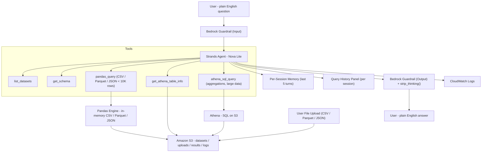

# 🥕🎵 NL Query Agent

> A production-grade Natural Language Data Query Agent built on AWS — ask questions in plain English, get answers from your S3 data. Supports CSV, Parquet, and JSON. Upload your own datasets. Remembers your conversation.

---

## 🏗️ Architecture Overview

### Mermaid diagram



### ASCII Architecture

```text
┌─────────────────────────────────────────────────────────────────────┐
│                        USER (Plain English)                         │
│         "What are the top 5 states by farmers market count?"        │
│                                                                     │
│   🖥️  Web UI  ──────────────────────────────────────────────────   │
│   ┌──────────────────┐  ┌─────────────────┐  ┌─────────────────┐  │
│   │  📂 Upload Panel  │  │  🕘 Query History│  │  💬 Chat + SSE  │  │
│   │  CSV/Parquet/JSON │  │  Per-session    │  │  Streaming resp │  │
│   └──────────────────┘  └─────────────────┘  └─────────────────┘  │
└───────────────────────────────┬─────────────────────────────────────┘
                                │
                                ▼
┌─────────────────────────────────────────────────────────────────────┐
│                    🛡️  BEDROCK GUARDRAIL (INPUT)                    │
│         Blocks: hate, violence, prompt attacks, off-topic           │
│         Anonymizes: PII (emails, phone numbers, names)              │
└───────────────────────────────┬─────────────────────────────────────┘
                                │ safe input only
                                ▼
┌─────────────────────────────────────────────────────────────────────┐
│              🤖  STRANDS AGENT (Orchestration Layer)                │
│                  Model: Amazon Nova Lite (Bedrock)                  │
│                                                                     │
│   Agent autonomously decides which tool to call:                    │
│                                                                     │
│   ┌─────────────────┐   ┌──────────────────┐   ┌───────────────┐  │
│   │  list_datasets  │   │   get_schema     │   │ pandas_query  │  │
│   │  All datasets   │   │  Column names,   │   │ In-memory     │  │
│   │  incl. uploads  │   │  types, samples  │   │ CSV/Parquet/  │  │
│   └─────────────────┘   └──────────────────┘   │ JSON < 10K    │  │
│                                                 └───────────────┘  │
│   ┌──────────────────────────┐   ┌──────────────────────────────┐  │
│   │  get_athena_table_info   │   │     athena_sql_query         │  │
│   │  Exact column names for  │   │  Real SQL on S3 via Athena   │  │
│   │  SQL query building      │   │  COUNT/GROUP BY/TOP N        │  │
│   └──────────────────────────┘   │  Max 2 retries → pandas      │  │
│                                  └──────────────────────────────┘  │
│                                                                     │
│   🧠 Per-Session Conversation Memory                                │
│      Last 5 Q&A turns · isolated by session_id (localStorage)      │
└───────────────────────────────┬─────────────────────────────────────┘
                                │
                    ┌───────────┴────────────┐
                    │                        │
                    ▼                        ▼
   ┌─────────────────────┐     ┌─────────────────────────────┐
   │   🐼 PANDAS ENGINE  │     │     🔍 AMAZON ATHENA        │
   │   CSV / Parquet /   │     │     For large data / SQL    │
   │   JSON < 10K rows   │     │     ≥ 10,000 rows           │
   │   Loaded into RAM   │     │     Serverless SQL on S3    │
   └──────────┬──────────┘     └──────────────┬──────────────┘
              │                               │
              └───────────────┬───────────────┘
                              │ reads from / writes to
                              ▼
             ┌────────────────────────────────────────┐
             │              ☁️  AMAZON S3              │
             │   s3://nl-query-agent-<you>            │
             │                                        │
             │   datasets/farmers_market/             │
             │     └── farmers_market.csv             │
             │   datasets/spotify/                    │
             │     └── spotify.csv                    │
             │   datasets/<uploaded>/                 │
             │     └── <file>.csv / .parquet / .json  │
             │   athena-results/  (temp)              │
             │   logs/YYYY/MM/DD/ (archived sessions) │
             └────────────────────────────────────────┘
                              │
                              ▼
┌─────────────────────────────────────────────────────────────────────┐
│                    🛡️  BEDROCK GUARDRAIL (OUTPUT)                   │
│         Checks agent response before showing to user                │
│         Grounding threshold: 0.7 | Relevance threshold: 0.7         │
│         strip_thinking() removes  tags      │
└───────────────────────────────┬─────────────────────────────────────┘
                                │ safe response only
                                ▼
┌─────────────────────────────────────────────────────────────────────┐
│                   📊  CLOUDWATCH LOGS                               │
│   Logs every event: USER_QUERY | AGENT_RESPONSE | GUARDRAIL_EVENT   │
│   Retention: 90 days | Archive: exported to S3 on quit/archive      │
└─────────────────────────────────────────────────────────────────────┘
                                │
                                ▼
                    ┌───────────────────────┐
                    │   👤 USER RESPONSE    │
                    │   Plain English answer│
                    └───────────────────────┘
```

---

## ✨ What's New (v2)

| Feature | Details |
|---------|---------|
| **Multi-format datasets** | Upload and query CSV, Parquet, and JSON — auto-detected by file extension |
| **Per-session memory** | Agent remembers the last 5 Q&A turns per browser tab for follow-up questions |
| **Dataset upload via UI** | Drag-and-drop in the web sidebar — uploads to S3 and registers to Athena instantly |
| **Query history panel** | Left sidebar logs every question; click any item to re-populate the input |
| **Dynamic dataset registry** | Uploaded datasets available to all tools immediately, no server restart |
| **`strip_thinking()`** | Nova Lite internal `<thinking>` tags filtered before responses reach the user |
| **Session isolation** | Each browser tab gets its own `session_id` via localStorage |

---

## 🗂️ Project Structure

```text
nl-query-agent/
│
├── config.py              ← ⚙️  All settings — BUCKET, REGION, DATASETS, thresholds
├── requirements.txt       ← 📦 Python dependencies
│
├── upload_data.py         ← 🚀 STEP 1: Creates S3 bucket + uploads initial CSVs
├── guardrail_setup.py     ← 🛡️  STEP 2: Creates Bedrock Guardrail
│
├── athena_helper.py       ← 🔧 Athena runner + multi-format table sync (CSV/Parquet/JSON)
├── logger.py              ← 🔧 CloudWatch logging + S3 archival
│
├── agent.py               ← 🤖 Agent core: tools, per-session memory, run_query()
├── server.py              ← 🌐 FastAPI: /query /upload /history /clear endpoints
├── templates/
│   └── index.html         ← 💬 Chat UI with upload panel + query history sidebar
│
├── farmers_market.csv     ← 📊 Bundled dataset
├── spotify.csv            ← 📊 Bundled dataset
└── README.md              ← 📖 This file
```

### File Responsibilities

| File | Run It? | Purpose |
|------|---------|---------|
| `config.py` | ❌ Edit once | BUCKET, REGION, MODEL_ID, DATASETS, thresholds |
| `requirements.txt` | ❌ Used by pip | Python package list |
| `upload_data.py` | ✅ Run once | Creates S3 bucket, uploads CSVs, registers Athena DB |
| `guardrail_setup.py` | ✅ Run once | Creates Bedrock Guardrail + writes ID to `config.py` |
| `athena_helper.py` | ❌ Never directly | Athena queries + multi-format table sync |
| `logger.py` | ❌ Never directly | CloudWatch logging + S3 log archival |
| `agent.py` | ✅ Optional | Agent brain: tools, memory, run_query() |
| `server.py` | ✅ Run to start | FastAPI server at http://localhost:8000 |
| `templates/index.html` | ❌ | Chat UI with upload + history sidebar |

---

## ☁️ AWS Services Used

| Service | Role | Why |
|---------|------|-----|
| **Amazon S3** | Stores datasets (CSV/Parquet/JSON), Athena results, archived logs | Cheap, durable, serverless |
| **Amazon Athena** | Serverless SQL on S3 external tables | No database to manage |
| **AWS Glue Data Catalog** | Holds Athena table definitions | Athena uses Glue under the hood |
| **Amazon Bedrock** | Nova Lite LLM for reasoning + Guardrails for safety | Managed AI inference, no GPU |
| **Bedrock Guardrails** | Safety layer on input + output | Blocks harmful content, PII, off-topic |
| **Amazon CloudWatch Logs** | Structured logging with 90-day retention | Audit trail + debugging |

---

## 🧠 How the Agent Decides What To Do

The agent uses **Amazon Nova Lite (apac.amazon.nova-lite-v1:0)** via the Strands Agents SDK.

### Tool Selection Logic

```text
list_datasets
  → When user asks what data is available.
  → Returns all datasets including runtime-uploaded files.

get_schema
  → ALWAYS called first for any dataset question.
  → Works for CSV, Parquet, and JSON.

pandas_query
  → Overviews, stats, filters, datasets < PANDAS_THRESHOLD rows.
  → Auto-detects file format (CSV / Parquet / JSON) via extension.

get_athena_table_info
  → Called before writing SQL to confirm exact column names.

athena_sql_query
  → COUNT, SUM, AVG, GROUP BY, ORDER BY, TOP N.
  → Max 2 retries per table; falls back to pandas_query on failure.
```

### Query Routing

```text
Dataset size < 10,000 rows?
    YES → pandas_query  (fast, in-memory — CSV / Parquet / JSON)
    NO  → athena_sql_query  (serverless SQL on S3)
```

### Conversation Memory

```text
Each browser tab → unique session_id (stored in localStorage)
Per session → last 5 Q&A turns stored in _sessions dict
Memory context → appended to every new prompt automatically
Terminal agent → uses session_id = "terminal"
Clear Session button → wipes memory + history + generates new session_id
```

---

## 🖥️ Web UI Features

- **Upload panel** — drag-and-drop CSV / Parquet / JSON; uploads to S3 + registers Athena table instantly
- **Query history sidebar** — all questions logged with timestamp; click to re-run
- **Streaming responses** — Server-Sent Events (SSE), no page reloads
- **Session memory** — last 5 turns remembered per browser tab
- **Clear Session** — wipes memory and history, generates new session ID

### API Endpoints

| Endpoint | Method | Purpose |
|----------|--------|---------|
| `/` | GET | Serves the chat UI |
| `/query` | POST | Streams agent response (SSE), accepts `session_id` |
| `/upload` | POST | Accepts file upload, registers to S3 + Athena |
| `/history` | GET | Returns query history list for a session |
| `/clear` | POST | Clears session memory and history |

---

## 🛡️ Guardrail Configuration

| Type | Input | Output |
|------|-------|--------|
| Hate speech | HIGH | HIGH |
| Insults | HIGH | HIGH |
| Violence | MEDIUM | MEDIUM |
| Misconduct | HIGH | HIGH |
| Prompt attacks | HIGH | NONE |

**PII Protection:** Emails, phone numbers, names → Anonymized. AWS keys, passwords → Blocked.

**Output Checks:** Grounding ≥ 0.7 · Relevance ≥ 0.7 · `<thinking>` tags stripped via `strip_thinking()`.

---

## 🛠️ Setup Order

### Step 0 — Local setup

```bash
python3 -m venv .venv
source .venv/bin/activate
pip install strands-agents boto3 pandas fastapi uvicorn python-multipart pyarrow
aws configure  # Region: ap-south-1
```

### Step 1 — Upload initial data

```bash
python3 upload_data.py
```

### Step 2 — Guardrail setup

```bash
python3 guardrail_setup.py
```

### Step 3 — Start the Web Server

**Option A — Foreground (terminal stays busy, Ctrl+C to stop):**

    cd ~/Documents/nl-query-agent && source .venv/bin/activate && python server.py

Then open your browser at `http://localhost:8000`

**Option B — Background (terminal stays free):**

    nohup python server.py & 

To stop the background server:

    pkill -f server.py

### Step 4 — (Optional) Resync Athena tables

```bash
# For CSV
python3 -c "from athena_helper import sync_table_from_csv; sync_table_from_csv('spotify', 'datasets/spotify.csv')"

# For Parquet or JSON (new in v2)
python3 -c "from athena_helper import sync_table_from_file; sync_table_from_file('iris', 'datasets/iris/iris.parquet')"
python3 -c "from athena_helper import sync_table_from_file; sync_table_from_file('output', 'datasets/output/output.json')"
```

### Step 5 — (Optional) Public URL via ngrok

```bash
ngrok http 8000
```

---

## 💬 Usage Examples

```text
You: What datasets are available?
Agent: Lists all registered datasets including any uploaded files.

You: Show me the schema of iris
Agent: Returns columns, types, and 3 sample rows for iris.parquet.

You: What is the average petal length by species?
Agent: Queries iris.parquet in-memory and returns grouped averages.

You: Which state has the most farmers markets?
Agent: Runs Athena GROUP BY + COUNT → "California with 1,528 markets."

You: What about the top 10?
Agent: Remembers the previous question and returns top 10 (memory).

You: archive
Agent: Archives logs to S3 immediately.

You: quit
Agent: Archives logs and exits.
```

---

## 📊 CloudWatch Log Events

```json
{"timestamp": "2026-05-13T10:30:00Z", "event_type": "USER_QUERY",      "question": "top 5 states by markets?"}
{"timestamp": "2026-05-13T10:30:02Z", "event_type": "AGENT_RESPONSE",  "query_mode": "ATHENA", "response_preview": "..."}
{"timestamp": "2026-05-13T10:30:03Z", "event_type": "GUARDRAIL_EVENT", "direction": "OUTPUT", "action": "ALLOWED"}
```

Archived to: `s3://nl-query-agent-<you>/logs/YYYY/MM/DD/agent-session-{timestamp}.json`

---

## ⚙️ Configuration Reference (`config.py`)

| Variable | Example | Description |
|----------|---------|-------------|
| `BUCKET` | `nl-query-agent-yourname` | Globally unique S3 bucket name |
| `REGION` | `ap-south-1` | AWS region |
| `ATHENA_DB` | `nl_query_db` | Athena database name |
| `ATHENA_OUTPUT` | `s3://…/athena-results/` | Where Athena writes query results |
| `MODEL_ID` | `apac.amazon.nova-lite-v1:0` | Bedrock model |
| `PANDAS_THRESHOLD` | `10_000` | Max rows for pandas_query |
| `DATASETS` | `{"farmers_market": "…", "spotify": "…"}` | Permanent dataset registry |
| `GUARDRAIL_ID` | `9iwaukwehxwu` | Set by `guardrail_setup.py` |
| `GUARDRAIL_VERSION` | `"1"` | Guardrail version |

---

## 🔧 Troubleshooting

| Symptom | Cause | Fix |
|--------|-------|-----|
| `NoCredentialsError` | AWS not configured | Run `aws configure` |
| `AccessDeniedException` | Missing IAM permissions | Add S3, Athena, Bedrock, CloudWatch policy |
| `BucketAlreadyExists` | Bucket name taken | Change `BUCKET` in `config.py` |
| `COLUMN_NOT_FOUND` in Athena | Schema drift | Run `sync_table_from_file(...)` |
| Parquet upload fails | Missing pyarrow | `pip install pyarrow` |
| File upload returns 422 | Missing python-multipart | `pip install python-multipart` |
| `<thinking>` tags in response | Nova Lite chain-of-thought leak | Fixed in v2 via `strip_thinking()` |
| Dataset missing after restart | Not in `config.py` DATASETS | Add entry to DATASETS or re-upload via UI |
| Agent loops on Athena errors | Too many retries | Capped at 2 attempts; falls back to pandas |
| Web UI 404 on `/` | Missing `templates/index.html` | Ensure file exists and run from project root |

---

## 💰 AWS Cost Estimate

| Service | Usage | Est. Cost |
|---------|-------|-----------|
| S3 | ~10MB data + logs | < $0.01/month |
| Athena | Small queries | ~$0.00005/query |
| Bedrock Nova Lite | Per token | < $1/month dev usage |
| CloudWatch Logs | < 1 GB | < $0.50/month |
| **Total** | | **< $1/month** |

---

*Built on AWS Strands Agents SDK · Amazon Bedrock · Athena · S3 · CloudWatch · FastAPI*  
*v2: Multi-format (CSV · Parquet · JSON) · Conversation Memory · Dataset Upload UI · Query History*