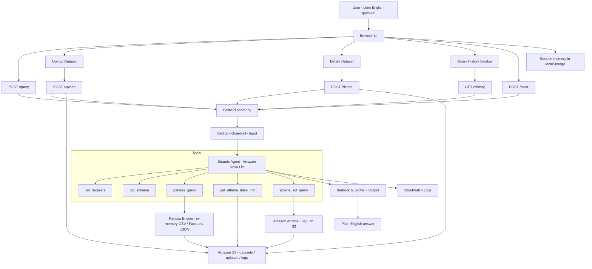

# 🤖 NL Query Agent

> A production-grade Natural Language Data Query Agent built on AWS — ask questions in plain English and get answers from your data in S3. Supports CSV, Parquet, and JSON. Upload, query, and delete datasets directly from the browser UI. Remembers your conversation per session, keeps history in the sidebar, and is hardened with IAM and Bedrock Guardrails.

---

## Table of Contents

- [Overview](#overview)
- [Architecture Overview](#architecture-overview)
- [What's New](#whats-new)
- [Project Structure](#project-structure)
- [AWS Services Used](#aws-services-used)
- [How the Agent Decides What To Do](#how-the-agent-decides-what-to-do)
- [Web UI Features](#web-ui-features)
- [Guardrails and Security](#guardrails-and-security)
- [Setup Order](#setup-order)
- [Usage Examples](#usage-examples)
- [CloudWatch Log Events](#cloudwatch-log-events)
- [Configuration Reference](#configuration-reference)
- [Troubleshooting](#troubleshooting)
- [AWS Cost Estimate](#aws-cost-estimate)

---

## Overview

Most analysts still have to choose between writing SQL, waiting on engineers, or manually handling data in S3. This project makes structured data feel conversational while keeping the system production-ready and secure.

The agent answers natural-language questions over CSV, Parquet, and JSON datasets. It automatically routes small datasets to Pandas and larger workloads to Athena, while Bedrock Guardrails and IAM hardening protect the workflow end to end.

It now runs behind a browser UI built with FastAPI, so you can upload datasets, delete them, view history, and query data from any browser tab.

---

## Architecture Overview

### Mermaid diagram



### ASCII Architecture

```text
┌─────────────────────────────────────────────────────────────────────┐
│                              USER                                   │
│         "What are the top 5 states by farmers market count?"        │
└───────────────────────────────┬─────────────────────────────────────┘
                                │
                                ▼
┌─────────────────────────────────────────────────────────────────────┐
│                            BROWSER UI                               │
│  ┌──────────────────┐  ┌──────────────────┐  ┌──────────────────┐  │
│  │ Upload Dataset   │  │ Delete Dataset   │  │ Query History    │  │
│  │ CSV/Parquet/JSON │  │ No S3 console    │  │ One-click rerun  │  │
│  └──────────────────┘  └──────────────────┘  └──────────────────┘  │
│  ┌──────────────────────────────────────────────────────────────┐   │
│  │ Session-aware memory via localStorage per browser tab       │   │
│  └──────────────────────────────────────────────────────────────┘   │
└───────────────────────────────┬─────────────────────────────────────┘
                                │
                                ▼
┌─────────────────────────────────────────────────────────────────────┐
│                           FASTAPI SERVER                             │
│  /query   /upload   /delete   /history   /clear                      │
│  JSON responses for query flow                                       │
└───────────────────────────────┬─────────────────────────────────────┘
                                │
                     ┌──────────┴───────────┐
                     ▼                      ▼
┌───────────────────────────────┐   ┌───────────────────────────────┐
│   BEDROCK GUARDRAIL (Input)   │   │   BEDROCK GUARDRAIL (Output)  │
│   blocks unsafe prompts       │   │   filters final responses     │
└───────────────┬───────────────┘   └───────────────┬───────────────┘
                │                                   │
                ▼                                   ▼
┌─────────────────────────────────────────────────────────────────────┐
│                       STRANDS AGENT + NOVA LITE                     │
│                                                                     │
│  Tool routing:                                                      │
│  -  list_datasets                                                    │
│  -  get_schema                                                       │
│  -  pandas_query                                                     │
│  -  get_athena_table_info                                            │
│  -  athena_sql_query                                                 │
│                                                                     │
│  Routing logic:                                                     │
│  -  Small datasets -> Pandas                                         │
│  -  Large datasets -> Athena                                          │
└───────────────────────────────┬─────────────────────────────────────┘
                                │
                    ┌───────────┴───────────┐
                    ▼                       ▼
        ┌──────────────────────┐   ┌───────────────────────────────┐
        │  PANDAS ENGINE       │   │  AMAZON ATHENA                │
        │  in-memory analysis   │   │  serverless SQL on S3         │
        └──────────┬───────────┘   └──────────────┬────────────────┘
                   │                              │
                   └──────────────┬───────────────┘
                                  ▼
┌─────────────────────────────────────────────────────────────────────┐
│                              AMAZON S3                              │
│  datasets/  uploads/  athena-results/  logs/                        │
└───────────────────────────────┬─────────────────────────────────────┘
                                │
                                ▼
┌─────────────────────────────────────────────────────────────────────┐
│                        CLOUDWATCH LOGS                               │
│  queries, responses, guardrail events, debugging                    │
└───────────────────────────────┬─────────────────────────────────────┘
                                │
                                ▼
                         ┌───────────────┐
                         │  USER ANSWER  │
                         └───────────────┘
```

---

## What's New

| Feature | Details |
|---|---|
| Browser upload UI | Upload CSV, Parquet, or JSON directly from the app. |
| Browser delete UI | Delete datasets from the app without opening the S3 console. |
| Query history | Sidebar shows previous questions for the current session. |
| Session-aware memory | Each browser tab has its own session context via `localStorage`. |
| Multi-format support | CSV, Parquet, and JSON are all supported through the same agent flow. |
| IAM hardening | Tighter permissions for safer access control. |
| Bedrock Guardrails | Input and output safety checks remain enforced. |
| CloudWatch logging | Every query, response, and guardrail decision is logged. |
| FastAPI API layer | `/query`, `/upload`, `/delete`, `/history`, and `/clear` endpoints. |
| JSON query flow | The browser now reads `/query` as JSON instead of stream chunks. |

---

## Project Structure

```text
nl-query-agent/
│
├── config.py              ← ⚙️ All settings — BUCKET, REGION, DATASETS, thresholds
├── requirements.txt       ← 📦 Python dependencies
│
├── upload_data.py         ← 🚀 Step 1: Create S3 bucket + upload initial datasets
├── guardrail_setup.py     ← 🛡️ Step 2: Create Bedrock Guardrail
│
├── athena_helper.py       ← 🔧 Athena runner + multi-format table sync
├── logger.py              ← 🔧 CloudWatch logging + S3 archival
│
├── agent.py               ← 🤖 Agent core: tools, memory, run_query()
├── server.py              ← 🌐 FastAPI backend for UI + dataset ops
├── templates/
│   └── index.html         ← 💬 Browser UI for upload, delete, history, and chat
│
├── datasets/              ← 📁 Uploaded datasets live here in S3
└── README.md              ← 📖 This file
```

### File Responsibilities

| File | Run It? | Purpose |
|---|---|---|
| `config.py` | ❌ Edit once | BUCKET, REGION, MODEL_ID, DATASETS, thresholds |
| `requirements.txt` | ❌ Used by pip | Python package list |
| `upload_data.py` | ✅ Run once | Creates S3 bucket, uploads CSVs, registers Athena DB |
| `guardrail_setup.py` | ✅ Run once | Creates Bedrock Guardrail + writes ID to `config.py` |
| `athena_helper.py` | ❌ Never directly | Athena queries + multi-format table sync |
| `logger.py` | ❌ Never directly | CloudWatch logging + S3 log archival |
| `agent.py` | ✅ Optional | Agent brain: tools, memory, run_query() |
| `server.py` | ✅ Run to start | FastAPI server at http://localhost:8000 |
| `templates/index.html` | ❌ | Chat UI with upload, delete, and history sidebar |

---

## AWS Services Used

| Service | Role | Why |
|---|---|---|
| Amazon S3 | Stores datasets, Athena results, and archived logs. | Cheap, durable, serverless. |
| Amazon Athena | Serverless SQL for larger datasets. | No database to manage. |
| AWS Glue Data Catalog | Holds Athena table definitions. | Athena uses Glue under the hood. |
| Amazon Bedrock | Nova Lite for reasoning and Guardrails for safety. | Managed AI inference, no GPU. |
| Bedrock Guardrails | Safety layer on input + output. | Blocks harmful content, PII, off-topic prompts. |
| Amazon CloudWatch Logs | Structured logging with retention. | Audit trail + debugging. |
| AWS IAM | Least-privilege access control. | Reduces blast radius and limits access. |

---

## How the Agent Decides What To Do

The agent uses **Amazon Nova Lite** via the Strands Agents SDK.

### Tool Selection Logic

```text
list_datasets
  → When user asks what data is available.
  → Returns all datasets including runtime-uploaded files.

get_schema
  → ALWAYS called first for any dataset question.
  → Works for CSV, Parquet, and JSON.

pandas_query
  → Overviews, stats, filters, datasets < PANDAS_THRESHOLD rows.
  → Auto-detects file format via extension.

get_athena_table_info
  → Called before writing SQL to confirm exact column names.

athena_sql_query
  → COUNT, SUM, AVG, GROUP BY, ORDER BY, TOP N.
  → Max 2 retries per table; falls back to pandas_query on failure.
```

### Query Routing

```text
Dataset size < 10,000 rows?
    YES → pandas_query
    NO  → athena_sql_query
```

### Conversation Memory

```text
Each browser tab → unique session_id (stored in localStorage)
Per session → recent Q&A turns kept for follow-ups
Terminal agent → uses session_id = "terminal"
Clear Session button → wipes memory + history + generates a new session_id
```

---

## Web UI Features

- Upload datasets directly from the browser.
- Delete datasets directly from the browser.
- View query history and re-run past questions.
- Keep memory scoped per browser tab.
- Talk to the agent from any browser, not just terminal.

### API Endpoints

| Endpoint | Method | Purpose |
|---|---|---|
| `/` | GET | Serves the browser UI. |
| `/query` | POST | Returns the agent response as JSON. |
| `/upload` | POST | Uploads and registers a dataset. |
| `/delete` | POST | Deletes a dataset from S3 and registry. |
| `/history` | GET | Returns query history for the session. |
| `/clear` | POST | Clears session memory and history. |

---

## Guardrails and Security

| Layer | What it protects |
|---|---|
| Input Guardrail | Blocks unsafe or irrelevant prompts before they reach the agent. |
| Output Guardrail | Validates the final answer before it reaches the user. |
| IAM hardening | Limits S3, Athena, Bedrock, and CloudWatch access to only what the app needs. |
| Session isolation | Keeps browser sessions separate through `session_id`. |

---

## Setup Order

### 1) Local setup

```bash
python3 -m venv .venv
source .venv/bin/activate
pip install strands-agents boto3 pandas fastapi uvicorn python-multipart pyarrow
aws configure
```

### 2) Upload initial data

```bash
python3 upload_data.py
```

### 3) Set up guardrails

```bash
python3 guardrail_setup.py
```

### 4) Start the web server

```bash
python3 server.py
```

**Option A — Foreground (terminal stays busy, Ctrl+C to stop):**

    cd ~/Documents/nl-query-agent && source .venv/bin/activate && python server.py

Then open your browser at `http://localhost:8000`

**Option B — Background (terminal stays free):**

    nohup python server.py & 

To stop the background server:

    pkill -f server.py

Open:

```text
http://localhost:8000
```

### 5) Optional public URL

```bash
ngrok http 8000
```

---

## Usage Examples

```text
You: What datasets are available?
Agent: Lists all registered datasets, including uploaded ones.

You: Upload a new JSON dataset
Agent: Stores it in S3 and registers it immediately.

You: Delete the sample3 dataset
Agent: Removes it from S3 and the registry through the UI.

You: Show me the schema of iris
Agent: Returns columns, types, and sample rows.

You: Which state has the most farmers markets?
Agent: Uses Athena for the aggregation and returns the answer.
```

---

## CloudWatch Log Events

```json
{"timestamp": "2026-05-14T10:30:00Z", "event_type": "USER_QUERY", "question": "top 5 states by markets?"}
{"timestamp": "2026-05-14T10:30:02Z", "event_type": "AGENT_RESPONSE", "query_mode": "ATHENA"}
{"timestamp": "2026-05-14T10:30:03Z", "event_type": "GUARDRAIL_EVENT", "direction": "OUTPUT", "action": "ALLOWED"}
```

Archived to:

```text
s3://nl-query-agent-<you>/logs/YYYY/MM/DD/agent-session-{timestamp}.json
```

---

## Configuration Reference

| Variable | Description |
|---|---|
| `BUCKET` | S3 bucket for datasets and logs. |
| `REGION` | AWS region. |
| `ATHENA_DB` | Athena database name. |
| `MODEL_ID` | Bedrock model ID for Nova Lite. |
| `PANDAS_THRESHOLD` | Row threshold for Pandas routing. |
| `DATASETS` | Base dataset registry. |
| `GUARDRAIL_ID` | Bedrock Guardrail ID. |
| `GUARDRAIL_VERSION` | Guardrail version. |

---

## Troubleshooting

| Symptom | Fix |
|---|---|
| `NoCredentialsError` | Run `aws configure`. |
| `AccessDeniedException` | Update IAM permissions for S3, Athena, Bedrock, and CloudWatch. |
| `BucketAlreadyExists` | Change the S3 bucket name in `config.py`. |
| `COLUMN_NOT_FOUND` in Athena | Refresh the Athena schema sync. |
| File upload fails | Install `python-multipart` and `pyarrow`. |
| Dataset missing after restart | Re-upload it through the browser UI or add it to the registry. |
| Query response looks stale | Refresh the page and re-run from history. |
| JSON parse error in browser | Ensure `server.py` returns JSON and `index.html` uses `await res.json()`. |

---

## AWS Cost Estimate

| Service | Usage | Est. Cost |
|---|---|---|
| S3 | Small datasets + logs | < $0.01/month |
| Athena | Small query volumes | Low, pay-per-query |
| Bedrock Nova Lite | Token-based inference | Typically < $1/month dev usage |
| CloudWatch Logs | Light logging | Low |
| Total |  | Usually under $1/month |

---

*Built on AWS Strands Agents SDK · Amazon Bedrock · Athena · S3 · CloudWatch · FastAPI*  
*Latest: Browser upload/delete UI · Query history · Session-aware memory · Multi-format datasets · IAM hardening · JSON query flow*
