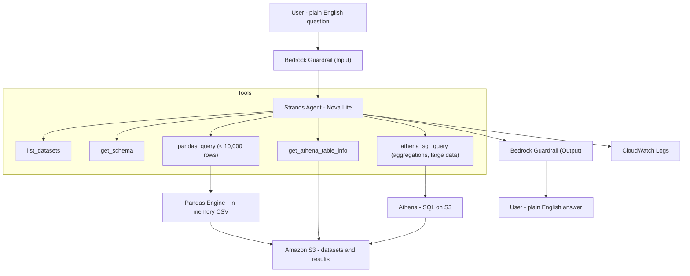

# 🥕🎵 NL Query Agent

> A production-grade Natural Language Data Query Agent built on AWS — ask questions in plain English, get answers from your S3 data. [file:20][web:29]

---

## 🏗️ Architecture Overview

### Mermaid diagram



### ASCII architecture (original)

```text
┌─────────────────────────────────────────────────────────────────────┐
│                        USER (Plain English)                         │
│              "What are the top 5 selling products?"                 │
└───────────────────────────────┬─────────────────────────────────────┘
                                │
                                ▼
┌─────────────────────────────────────────────────────────────────────┐
│                    🛡️  BEDROCK GUARDRAIL (INPUT)                    │
│         Blocks: hate, violence, prompt attacks, off-topic           │
│         Anonymizes: PII (emails, phone numbers, names)              │
└───────────────────────────────┬─────────────────────────────────────┘
                                │ safe input only
                                ▼
┌─────────────────────────────────────────────────────────────────────┐
│              🤖  STRANDS AGENT (Orchestration Layer)                │
│                  Model: Amazon Nova Lite (Bedrock)                  │
│                                                                     │
│   Agent autonomously decides which tool to call:                    │
│                                                                     │
│   ┌─────────────────┐   ┌──────────────────┐   ┌───────────────┐  │
│   │  list_datasets  │   │   get_schema     │   │ pandas_query  │  │
│   │  What data is   │   │  Column names,   │   │ In-memory     │  │
│   │  available?     │   │  types, samples  │   │ < 10,000 rows │  │
│   └─────────────────┘   └──────────────────┘   └───────────────┘  │
│                                                                     │
│   ┌──────────────────────────┐   ┌──────────────────────────────┐  │
│   │  get_athena_table_info   │   │     athena_sql_query         │  │
│   │  Exact column names for  │   │  Real SQL on S3 via Athena   │  │
│   │  SQL query building      │   │  Aggregations, filters, TOP N│  │
│   └──────────────────────────┘   └──────────────────────────────┘  │
└───────────────────────────────┬─────────────────────────────────────┘
                                │
                    ┌───────────┴────────────┐
                    │                        │
                    ▼                        ▼
   ┌─────────────────────┐     ┌─────────────────────────────┐
   │   🐼 PANDAS ENGINE  │     │     🔍 AMAZON ATHENA        │
   │   For small/med     │     │     For large data / SQL    │
   │   < 10,000 rows     │     │     > 10,000 rows           │
   │   Loaded into RAM   │     │     Serverless SQL on S3    │
   └──────────┬──────────┘     └──────────────┬──────────────┘
              │                               │
              └───────────────┬───────────────┘
                              │ reads from / writes to
                              ▼
             ┌────────────────────────────────┐
             │         ☁️  AMAZON S3          │
             │   s3://nl-query-agent-kaustubh │
             │                                │
             │   datasets/farmers_market.csv  │
             │   datasets/spotify.csv         │
             │   athena-results/  (temp)      │
             │   logs/  (archived sessions)   │
             └────────────────────────────────┘
                              │
                              ▼
┌─────────────────────────────────────────────────────────────────────┐
│                    🛡️  BEDROCK GUARDRAIL (OUTPUT)                   │
│         Checks agent response before showing to user                │
│         Grounding threshold: 0.7 | Relevance threshold: 0.7         │
└───────────────────────────────┬─────────────────────────────────────┘
                                │ safe response only
                                ▼
┌─────────────────────────────────────────────────────────────────────┐
│                   📊  CLOUDWATCH LOGS                               │
│   Logs every event: USER_QUERY | AGENT_RESPONSE | GUARDRAIL_EVENT   │
│   Retention: 90 days | Archive: exported to S3 on quit/archive      │
└─────────────────────────────────────────────────────────────────────┘
                                │
                                ▼
                    ┌───────────────────────┐
                    │   👤 USER RESPONSE    │
                    │   Plain English answer│
                    └───────────────────────┘
```

---

## 🗂️ Project Structure

```text
nl-query-agent/
│
├── config.py              ← ⚙️  All settings — edit BUCKET name here (once)
├── requirements.txt       ← 📦 Python dependencies
│
├── upload_data.py         ← 🚀 STEP 1: Creates S3 bucket + uploads CSVs
├── guardrail_setup.py     ← 🛡️  STEP 2: Creates Bedrock Guardrail
│
├── athena_helper.py       ← 🔧 Helper: Athena async runner + table sync
├── logger.py              ← 🔧 Helper: CloudWatch logging + S3 archival
│
├── agent.py               ← 🤖 STEP 3: The agent — run this daily
│
├── farmers_market.csv     ← 📊 Local copy of dataset (uploaded by upload_data.py)
├── spotify.csv            ← 📊 Local copy of dataset (uploaded by upload_data.py)
└── README.md              ← 📖 This file
```

### File Responsibilities

| File | Run It? | Purpose |
|------|---------|---------|
| `config.py` | ❌ Edit once | Single source of truth for BUCKET, REGION, MODEL_ID, thresholds |
| `requirements.txt` | ❌ Used by pip | Lists all Python packages needed |
| `upload_data.py` | ✅ Run once | Creates S3 bucket, uploads CSVs, registers initial Athena DB |
| `guardrail_setup.py` | ✅ Run once | Creates Bedrock Guardrail + auto-writes ID to `config.py` |
| `athena_helper.py` | ❌ Never directly | Runs Athena queries + can resync Athena tables from CSV |
| `logger.py` | ❌ Never directly | Structured CloudWatch logging + S3 log archival |
| `agent.py` | ✅ Run regularly | Main interactive agent loop |

---

## ☁️ AWS Services Used

| Service | Role in This Project | Why |
|---------|---------------------|-----|
| **Amazon S3** | Stores CSV datasets, Athena query results, and archived logs | Cheap, durable, serverless storage [web:77] |
| **Amazon Athena** | Runs SQL directly on S3 CSV files via external tables | No database to manage — query data where it lives [web:71][web:78] |
| **AWS Glue (Data Catalog)** | Holds Athena table definitions for your CSVs | Athena uses Glue under the hood [web:57] |
| **Amazon Bedrock** | Hosts Nova Lite LLM that powers the agent brain | Managed AI inference, no GPU needed [web:29] |
| **Bedrock Guardrails** | Safety layer on inputs + outputs | Blocks harmful content, PII, off-topic queries |
| **Amazon CloudWatch** | Logs every agent interaction with 90-day retention | Audit trail, debugging, session history |

---

## 🧠 How the Agent Decides What To Do

The agent uses **Amazon Nova Lite (apac.amazon.nova-lite-v1:0)** as its brain, orchestrated via the Strands Agents SDK. It reads your question, chooses tools, and returns a plain-English answer. [file:20][web:29]

### Tool Selection Logic

```text
list_datasets
  → When user asks what data is available.

get_schema
  → ALWAYS called first for a dataset question to see columns + sample rows.

pandas_query
  → Overviews, stats, filters, and any dataset under PANDAS_THRESHOLD rows
    (here: PANDAS_THRESHOLD = 10,000; farmers_market has 8,681 rows).

get_athena_table_info
  → Called before writing SQL to confirm exact column names for Athena.

athena_sql_query
  → COUNT, SUM, AVG, GROUP BY, ORDER BY, TOP N, filters on large datasets.
  → At most 2 calls per table per question; on repeated errors it falls
    back to pandas_query where possible.
```

### Query Routing (Pandas vs Athena)

```text
Dataset size < 10,000 rows?
    YES → pandas_query  (fast, in-memory CSV)
    NO  → athena_sql_query  (serverless SQL, handles larger data)
```

---

## 🛡️ Guardrail Configuration

The Bedrock Guardrail sits on both input and output.

### Content Filters

| Type | Input | Output |
|------|-------|--------|
| Hate speech | HIGH | HIGH |
| Insults | HIGH | HIGH |
| Violence | MEDIUM | MEDIUM |
| Misconduct | HIGH | HIGH |
| Prompt attacks | HIGH | NONE |

### Denied Topics

Any question not related to the configured datasets (farmers markets / Spotify) or data analysis is blocked.

### PII Protection

| Data Type | Action |
|-----------|--------|
| Email addresses | Anonymized |
| Phone numbers | Anonymized |
| Names | Anonymized |
| AWS Access Keys | Blocked |
| Passwords | Blocked |

### Grounding Check

- Grounding threshold: `0.7` — response must be grounded in actual data.  
- Relevance threshold: `0.7` — response must be relevant to the question.

---

## 📋 Setup Order (Start to Finish)

### Step 0 — Local setup

```bash
cd ~/Documents
# Create project folder and clone / copy files here

# Optional but recommended: create venv
python3 -m venv .venv
source .venv/bin/activate
pip install -r requirements.txt   # if present
pip install strands-agents boto3 pandas
```

Configure AWS CLI:

```bash
aws configure
# Region: ap-south-1
# Output: json
```

Enable Nova Lite in Bedrock (Console) and attach IAM policy with S3, Athena, Bedrock, CloudWatch permissions. [web:29][web:40]

### Step 1 — Upload data / initial tables

```bash
python3 upload_data.py
```

This creates:

- S3 bucket `nl-query-agent-kaustubh` (or your configured BUCKET).  
- Uploads:
  - `farmers_market.csv` → `s3://BUCKET/datasets/farmers_market.csv`  
  - `spotify.csv`        → `s3://BUCKET/datasets/spotify.csv`  
- Creates Athena DB `nl_query_db` and initial table definitions. [web:21][web:58]

### Step 2 — Guardrail setup

```bash
python3 guardrail_setup.py
```

This creates a Bedrock Guardrail and writes its ID + version into `config.py` (`GUARDRAIL_ID`, `GUARDRAIL_VERSION`).

### Step 3 — (Optional) Resync Athena tables from CSV

If Athena schemas are ever wrong or drift out of sync, you can recreate them directly from the CSV header using `athena_helper.py`:

```bash
cd ~/Documents/nl-query-agent

# Recreate spotify table from datasets/spotify.csv
python3 -c "from athena_helper import sync_table_from_csv; sync_table_from_csv('spotify', 'datasets/spotify.csv')"

# Recreate farmers_market table from datasets/farmers_market.csv
python3 -c "from athena_helper import sync_table_from_csv; sync_table_from_csv('farmers_market', 'datasets/farmers_market.csv')"
```

This will:

- Drop the existing table if it exists.  
- Create a new external table with:
  - Columns taken from the CSV header, sanitized to lowercase.  
  - All columns as `string`.  
  - OpenCSVSerde and `skip.header.line.count='1'`. [web:10][web:25][web:61]

### Step 4 — Run the Agent

```bash
cd ~/Documents/nl-query-agent
python3 agent.py
```

You’ll see the banner and can start asking questions in plain English.

---

## 💬 Usage Examples

```text
You: Show me songs by Diljit Dosanjh.
Agent: Lists songs from the spotify dataset matching artist = 'Diljit Dosanjh'.

You: Which state has the most farmers markets?
Agent: Uses aggregation (COUNT + GROUP BY) and answers e.g. "California with 1,528 markets."

You: Top 5 states by farmers market count.
Agent: Returns top 5 states with counts.

You: Average user_rating by subscription_type in the spotify dataset.
Agent: Computes average rating for Family / Free / Premium using pandas or Athena depending on context.

You: archive
Agent: Archives logs to S3 immediately.

You: quit
Agent: Archives logs and exits.
```

---

## 📊 CloudWatch Log Events

Every interaction is logged as structured JSON in CloudWatch and archived into S3: [file:20][web:59]

```json
{"timestamp": "2026-05-12T10:30:00Z", "event_type": "USER_QUERY",      "question": "top 5 states by markets?"}
{"timestamp": "2026-05-12T10:30:02Z", "event_type": "AGENT_RESPONSE",  "query_mode": "ATHENA", "response_preview": "..."}
{"timestamp": "2026-05-12T10:30:03Z", "event_type": "GUARDRAIL_EVENT", "direction": "OUTPUT", "action": "ALLOWED"}
```

Archived in S3 as:

```text
s3://nl-query-agent-kaustubh/logs/YYYY/MM/DD/agent-session-{timestamp}.json
```

---

## ⚙️ Configuration Reference (`config.py`)

| Variable | Example | Description |
|----------|---------|-------------|
| `BUCKET` | `nl-query-agent-kaustubh` | Globally unique S3 bucket name |
| `REGION` | `ap-south-1` | AWS Mumbai region |
| `ATHENA_DB` | `nl_query_db` | Athena database name |
| `ATHENA_OUTPUT` | `s3://nl-query-agent-kaustubh/athena-results/` | Where Athena writes query results |
| `MODEL_ID` | `apac.amazon.nova-lite-v1:0` | Bedrock model (Nova Lite) |
| `PANDAS_THRESHOLD` | `10_000` | Max rows for pandas_query (farmers_market is 8,681) |
| `DATASETS` | `{"farmers_market": "datasets/farmers_market.csv", "spotify": "datasets/spotify.csv"}` | S3 keys for CSVs |
| `GUARDRAIL_ID` | `9iwaukwehxwu` | Guardrail ID (set by `guardrail_setup.py`) |
| `GUARDRAIL_VERSION` | `"1"` | Guardrail version |

---

## 🔧 Troubleshooting

| Symptom | Cause | Fix |
|--------|-------|-----|
| `NoCredentialsError` | AWS not configured locally | Run `aws configure` |
| `AccessDeniedException` | Missing IAM permissions | Attach IAM policy with S3, Athena, Bedrock, CloudWatch access |
| `BucketAlreadyExists` | Bucket name taken | Change `BUCKET` in `config.py` and rerun `python3 upload_data.py` |
| `COLUMN_NOT_FOUND` in Athena | Table schema drift | Run `sync_table_from_csv('...', 'datasets/....csv')` again |
| Agent loops on Athena errors | Too many Athena retries | Already fixed in `agent.py` — it caps at 2 attempts and falls back to pandas |
| Agent says “Athena query limit reached” | Athena still failing after 2 attempts | Ask a pandas-style question or resync the table from CSV |

---

## 💰 AWS Cost Estimate

| Service | Usage | Estimated Cost |
|---------|-------|----------------|
| S3 | ~10MB data + logs | < $0.01/month [web:77] |
| Athena | Per query scanned | ~$5 per TB scanned, ~\$0.00005 per small query [web:71][web:73] |
| Bedrock (Nova Lite) | Per token | Roughly \$0.07 / 1M input, \$0.28 / 1M output tokens in 2026 [web:76][web:79] |
| CloudWatch Logs | 90-day retention | ~$0.50/GB ingested; your usage is well below 1GB [web:80] |

For normal development usage this project should be well under **$1/month**.

---

*Built with ❤️ using AWS Strands Agents SDK, Amazon Bedrock, Athena, and boto3.*
